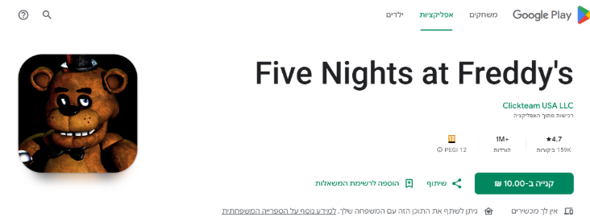

<h1>🐄 פרה עיוורת – Blind Cow</h1>

<strong>"המשחק שיחדד את החושים שלכם! (לא לחירשים)"</strong>

<ul>
  <li><strong>מהות המשחק:</strong> מטרת המשחק היא להביא את משחק הילדות <em>"פרה עיוורת"</em> לעולם הווירטואלי, תוך חידוד חושי השמיעה והתגובה לצלילים.  
  החוויה האולטימטיבית היא במשקפי VR, אך המשחק מותאם גם לפלטפורמות של טלפונים ניידים.</li>
  <li><strong>שחקן פרה:</strong> מטרתו לתפוס את כל השחקנים בזמן מוגבל, כאשר "עיניו" מכוסות חלקית והוא רואה רק מלמטה.</li>
  <li><strong>שחקן בורח:</strong> עליו להימנע מלהיתפס – כל צעד או תנועה שלו יוצרים רעש שהפרה שומעת.</li>
</ul>

(Gimini)

<h2> שחקנים</h2>
<ul>
  <li>המשחק מיועד לשחקנים לא מקצועיים בגילאי 6–9 שאוהבים משחקי חוץ ורוצים לשחק גם בבית.</li>
  <li>אוכלוסיית היעד בתחום השיקומי־התפתחותי: ילדים בעלי עיכוב מוטורי ו/או קוגניטיבי.</li>
  <li>3–8 שחקנים במשחק, המשחק תחרותי – כולם נגד הפרה העיוורת.</li>
  <li>כל הבורחים מרוויחים כסף על חשבון השחקן בתפקיד הפרה העיוורת.</li>
</ul>

<h2> יעדים</h2>
<ul>
  <li>אם השחקן הוא <strong>בורח</strong> – עליו להתחמק מהפרה במשך זמן מוגבל (נקבע לפי מספר המשתתפים).</li>
  <li>אם השחקן הוא <strong>פרה</strong> – עליו לתפוס כמה שיותר שחקנים בזמן הקצוב, תוך ראות מוגבלת.</li>
  <li>בהפעלה הראשונה יוצג סרטון הדרכה לשני התפקידים, וכן מדריך זמין בתפריט הראשי.</li>
  <li>כאשר השחקן בתפקיד הפרה תופס מישהו – יישמעו קריאות "מו" שמחות.  
  כאשר שחקן מצליח לברוח – יישמעו צחקוקי ילדים.</li>
</ul>

<h2>תהליכים</h2>
<ul>
  <li>המשחק מתנהל כולו במסך מגע של טלפון נייד.</li>
  <li><strong>תהליך התחלה:</strong> במסך הראשי יש כפתור <em>Play</em>.  
  לאחר מכן השחקן בוחר תפקיד – <strong>cow</strong> או <strong>runner</strong>.  
  - בבחירת תפקיד <strong>cow</strong>: המסך מחשיך, כיסוי עיניים חלקי מופיע, ויש ספירה לאחור של 10 שניות.  
  בזמן זה שאר השחקנים מתמקמים.  
  - מוצגים חצים שמייצגים צעדים וקולות בסביבה, כחלק מהמדריך הראשוני.</li>
  <li><strong>תהליך עיקרי:</strong>  
  השחקן בתפקיד הפרה שומע צעדים ויכול לנוע לכיוונם כדי לתפוס.  
  כל תפיסה מזכה אותו ב־500 מטבעות.  
  במהלך המשחק נטענת היכולת "כווולם השמיעו קול", מאלץ את כולם להגיב "קוקוריקו תרנגול".  
  השחקן בתפקיד הבורח מקבל 10 שניות של חסד להתמקמות, וצריך לנוע במינימום רעש.  
  ריצה מרעישה יותר מהליכה, היתקלות גורמת לרעש חזק.</li>
  <li><strong>יכולות ומטבעות:</strong>  
  ניתן לאסוף מטבעות במהלך המשחק.  
  המטבעות מעניקים כסף או יכולות מיוחדות כגון:
    <ul>
      <li>“סופר שקט” – אין רעש כלל ל־10 שניות</li>
      <li>“היעלמות” – השחקן נעלם ל־10 שניות אך עדיין נשמע</li>
      <li>“מהירות על” – השחקן נע מהר מהרגיל</li>
    </ul>
  </li>
  <li><strong>עלות וזכייה:</strong>  
  כל משחק עולה:
    <ul>
      <li>בורח – 200 מטבעות</li>
      <li>פרה – 1000 מטבעות</li>
    </ul>
  אם הבורח שורד עד סוף הזמן – הוא מכפיל את כספו ומרוויח 400 מטבעות.</li>
  <li><strong>תהליך סיום:</strong>  
  בסיום המשחק מוצג המסך המרכזי המציג את זכיית השחקן או הפסדו.  
  לאחר מכן ניתן לבחור להמשיך עם אותה קבוצה או להצטרף לקבוצה חדשה.  
     המטבעות שהורווחו נשמרים להמשך.</li>

<h4> מיומנויות נלמדות</h4>
<ul>
  <li><strong>תמרון וזרימה:</strong> שיפור מיומנויות מוטוריות באצבעות – שליטה בתנועה באמצעות מקשים או עכבר.</li>
  <li><strong>תפקודים קוגניטיביים גבוהים:</strong> שיפוט, קשב ותגובה לגירויים שמיעתיים וחזותיים.</li>
  <li><strong>תפיסה חזותית:</strong> הבחנה בדמויות ורגליים מטושטשות דרך כיסוי העיניים.</li>
  <li><strong>תגובה לגירויים:</strong> תגובה לצלילים, צעדים ותנועות בזירה.</li>
</ul>

<h2> חוקים</h2>
<ul>
  <li>3–8 שחקנים במשחק.</li>
  <li>רק שחקן אחד יכול להיות פרה, כל השאר הם בורחים.</li>
  <li>הפרה מהירה יותר מהבורחים, למעט אם הבורח קיבל יכולת “מהירות”.</li>
  <li>אם הפרה תופסת את כל השחקנים – היא מקבלת 10 מטבעות לכל שנייה שנותרה בזמן המשחק.</li>
  <li><strong>יכולות מיוחדות של הפרה:</strong>
    <ul>
      <li>“השמיעו קול” – מאלצת את כל הבורחים לצעוק “קוקוריקו תרנגול”.</li>
      <li>“הצצה מהירה” – מאפשרת ראייה מלאה ל־3 שניות.</li>
    </ul>
  </li>
  <li>בורח מקבל מד דציבלים שמראה כמה רעש כל פעולה יוצרת.</li>
  <li>בורח יכול לאסוף יכולות מיוחדות:  
    “סופר שקט”, “מהירות”, “היעלמות”, “איטיות”, “שתיקה בעת קריאה”.</li>
  <li>שחקן שנתפס נפסל ומחכה למשחק הבא.</li>
  <li>במדריך הראשוני יוצגו כל החוקים בליווי סמלים ואיורים.</li>
</ul>

<h2> משאבים</h2>
<ul>
  <li>המשאבים במשחק הם מטבעות זהב. ניתן להרוויחם ע"י ניצחון במשחק.</li>
  <li>בורח מנצח אם לא נתפס, פרה מרוויחה לפי מספר השחקנים שנתפסו.</li>
  <li>אם הפרה תופסת את כולם – היא מקבלת בונוס של 10 מטבעות לכל שנייה שנותרה.</li>
  <li>בורחים יכולים לאסוף מטבעות בשטח המשחק, מה שמעודד תנועה ורעש.</li>
  <li>ניתן לקנות במשחק: סבבי משחק חדשים, דמויות (skins), ויכולות מיוחדות.</li>
  <li>כניסה יומית למשחק מזכה את השחקן בפרסומת וב־400 מטבעות בונוס.</li>
  <li>אם המטבעות אזלו – לא ניתן לשחק עד למחרת.</li>
  <li>סך המטבעות מוצג בצד שמאל למעלה ובסיום כל משחק.</li>
</ul>

<h2> עימותים</h2>
<ul>
  <li><strong>בורח מול פרה:</strong> עימות ישיר – אם נתפס מפסיד, אם נמלט מנצח.</li>
  <li><strong>שחקן מול שרת:</strong> התמודדות עם מגבלת הזמן.</li>
  <li><strong>שחקן מול עצמו:</strong> החלטות אסטרטגיות – באיזה תפקיד לבחור ומתי להשתמש ביכולות.</li>
</ul>

<h2> גבולות</h2>
<ul>
  <li>העולם סגור ומוגבל כדי למנוע הימלטות.</li>
  <li>העולם הראשון: חצר בית או גינת משחקים.</li>
  <li>שלבים מתקדמים: מרתף, חניה, חדר מראות, מבוך ועוד.</li>
  <li>הגבולות מסומנים בשיחים גבוהים או קירות שקופים שלא ניתן לעבור.</li>
  <li>הבורח רואה את כל המרחב, הפרה רואה חלקית בלבד ומקבלת מפה ייעודית.</li>
  <h4> עקרונות תכנון</h4>
  <li><strong>משמעות:</strong> המרחב הוא חצר הבית – מחבר בין חוויה אמיתית לוירטואלית.</li>
  <li><strong>ניידות:</strong> תנועה באמצעות ג'ויסטיק במסך המגע.</li>
  <li><strong>התמצאות:</strong> הבורח רואה את כל השטח, הפרה משתמשת במפה ובצלילים.</li>
  <li><strong>עניין:</strong> סביבה משתנה עם מכשולים, חפצים ויכולות חדשות בשלבים מתקדמים.</li>
  <li><strong>הכוונה:</strong> הפרה נעזרת בצלילים כדי לזהות מיקום בורחים.</li>
</ul>

<h2> תוצאות</h2>
<ul>
  <li>בורח שנתפס מפסיד 200 מטבעות; אם שורד – מרוויח 400.</li>
  <li>פרה שלא תפסה אף אחד מפסידה 1000 מטבעות; על כל שחקן שנתפס – מרוויחה 500.</li>
  <li>אם תפסה את כולם – מקבלת 10 מטבעות על כל שנייה שנותרה.</li>
  <li>ניתן להמשיך למשחקים נוספים תוך שמירה על המטבעות הקיימים.</li>
  <li>המשחק מעודד תחושת מסוגלות והישגיות בקרב ילדים בעלי קשיים התפתחותיים.</li>
</ul>

<h2> סקירת משחקים קיימים</h2>
<ul>
  

  <li><strong>Catch (שוטרים וגנבים):</strong> משחק רדיפה ללא מרכיב של ראייה מוגבלת או חוויה חושית.</li>
  <a href="https://apps.apple.com/us/app/catch-the-thief-3d/id1491476065">קישור</a>
    

      
    

    

  
  <li><strong>Five Nights at Freddy’s:</strong> משחק בריחה בחושך עם ראות מוגבלת, אך הדמות הנרדפת היא זו שלא רואה, לא הרודפת.</li>
  <a href="https://play.google.com/store/apps/details?id=com.scottgames.fivenightsatfreddys">קישור</a>
      

      
    

  
  <li><strong>Hello Neighbor:</strong> משחק התגנבות שבו יש מרכיב שמיעתי דומה, אך ללא אלמנט כיסוי עיניים.</li>
  <a href="https://play.google.com/store/search?q=hello%20neighbor&c=apps">קישור</a>
      

      
    

</ul>

<h2> ייחודיות המשחק</h2>
<ul>
  <li>שחזור חוויית הילדות "פרה עיוורת" בצבעוניות ובשמחה.</li>
  <li>שילוב מתח ודרמה מוזיקלית – המנגינה מתגברת ככל שהפרה מתקרבת.</li>
  <li>אלמנט ייחודי של <strong>כיסוי עיניים</strong> – חוויה חושית יוצאת דופן בשונה ממשחקים קיימים.</li>
</ul>

