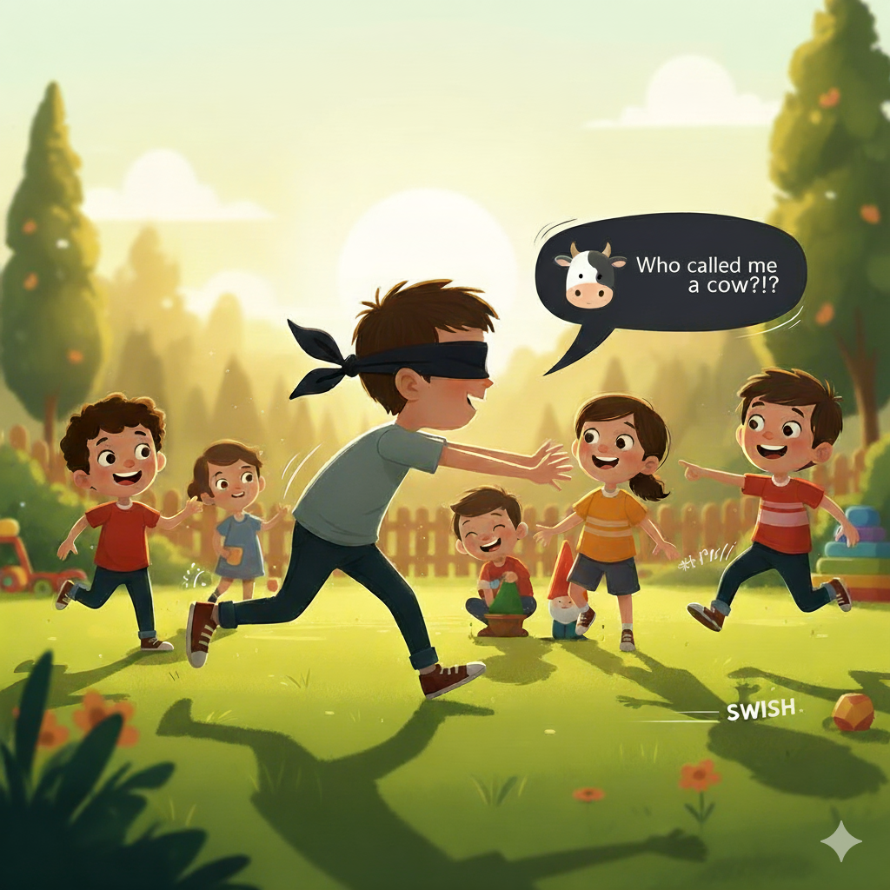

<h1> פרה עיוורת🐄</h1>

<strong>"המשחק שיחדד את החושים שלכם! (לא לחירשים)"</strong>

<ul>
  <li>במשחק משתתפים בין 3 ל־8 שחקנים.</li>
  <li>ישנם שני סוגי שחקנים – <strong>הפרה העיוורת</strong> ו<strong>הבורח</strong>.</li>
  <li>כאשר השחקן הוא הבורח, יש לו 10 שניות בהן הפרה מסתובבת כדי להתמקם. המטרה – להימנע מלהיתפס.</li>
  <li>כל צעד, היתקלות בחפץ או בשחקן אחר יוצרים רעש שהפרה שומעת – ויכולה לרוץ לכיוונו.</li>
  <li>לפרה יש 2 דקות לתפוס כמה שיותר משתתפים.</li>
  <li>השחקנים שבורחים יכולים לאסוף מטבעות ולהשתמש ביכולות מיוחדות כגון:
    <ul>
      <li><em>“סופר שקט”</em> – השחקן לא משמיע רעש למשך כמה שניות.</li>
      <li>שיפור מהירות, קפיצה ועוד.</li>
    </ul>
  </li>
  <li>כאשר השחקן הוא הפרה – הוא מקבל ניקוד על כל שחקן שנתפס, אך נענש על כל אחד שלא נתפס.</li>
  <li>לשחקן בתפקיד הפרה יש 3 אפשרויות להשתמש בפקודה מיוחדת:
    <em>“כווולם השמיעו קול!”</em>  
    כל השחקנים חייבים לענות: <strong>“קוקוריקו תרנגול!”</strong>
  </li>

  <h3>שמות חברי הצוות:</h3>
  <ul>
    <li>רז אונונו</li>
    <li>איתמר בבאי</li>
    <li>טל בן סימון – ריפוי בעיסוק</li>
    <li>טליה חורש – ריפוי בעיסוק</li>
  </ul>

    
  </il>
</ul>

